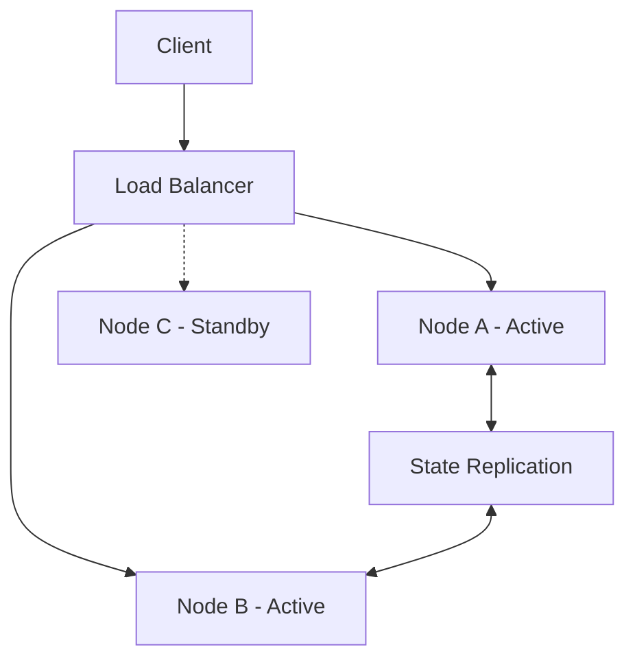

## 🧠 CONCEPT
**Availability** is the percentage of time a service or infrastructure remains accessible and functional under normal conditions. It measures the system's "up-time" and its ability to respond to requests as intended.

Mathematically, Availability ($A$) is defined as:
$$A = \frac{\text{Total Time} - \text{Downtime}}{\text{Total Time}} \times 100$$

### The "Nines" of Availability
| Availability % | Downtime per Year | Downtime per Month |
|----------------|-------------------|--------------------|
| 99% (Two Nines) | 3.65 days | 7.31 hours |
| 99.9% (Three Nines) | 8.77 hours | 43.83 minutes |
| 99.99% (Four Nines) | 52.60 minutes | 4.38 minutes |
| 99.999% (Five Nines) | 5.26 minutes | 26.30 seconds |

---

## ❓ WHY THIS EXISTS
- **Business Continuity**: High availability ensures that business operations (e.g., e-commerce checkouts) are not interrupted, preventing revenue loss.
- **User Trust**: Constant availability builds user confidence in the service.
- **SLA Compliance**: Many services have Service Level Agreements (SLAs) that mandate specific availability targets.

---

## 📉 HARDWARE MAPPING
- **CPU/Memory**: Redundant instances (active-active or active-passive) are required to survive hardware failure.
- **Disk**: RAID configurations or replicated storage (S3, EBS) ensure data availability despite disk crashes.
- **Network**: Multihomed networks and Global Server Load Balancing (GSLB) protect against ISP or regional outages.
- **Latency Impact**:
    - Heartbeat signals: ~1s (detection of node failure)
    - Failover time: ~10s - 2min (depending on DNS vs. Load Balancer level failover)

---

# ⚙️ INTERNAL MECHANICS

## 🔁 WRITE PATH (High Availability Pattern)
1. **Client** sends request to **Load Balancer**.
2. **Load Balancer** checks health of downstream nodes.
3. Request routed to healthy **Leader/Primary**.
4. **Write** is synchronously or asynchronously replicated to **Followers**.
5. **ACK** returned to client once minimum durability (Quorum) is met.

## 🔍 READ PATH
1. **Client** queries **Load Balancer/Service Mesh**.
2. **Read** is distributed among healthy replicas.
3. If a node is down, the **Load Balancer** transparently retries on another node.

## ⏳ TIME & STATE GAPS
- **Failover Window**: The interval between a node failing and the load balancer detecting it and rerouting traffic.
- **Propagation Delay**: In multi-region setups, there's a window where a service might be "available" but serving stale data due to replication lag.

---

# 🏗️ ARCHITECTURE

---

# 🔗 CROSS-LAYER DEPENDENCIES
- **Upstream**: L1 Network (Latency defines detection speed), L2 Storage (Durability of logs for recovery).
- **Downstream**: L3 CAP Theorem (Availability vs. Consistency trade-offs).
- **Adjacent**: Caching (serves stale data if backend is unavailable).

---

# ⚖️ TRADE-OFFS
- **Availability vs. Consistency**: (CAP Theorem) To maintain high availability during a network partition, you may have to sacrifice strong consistency (serving potentially stale data).
- **Cost vs. Availability**: Achieving "Five Nines" requires significant redundancy and complex failover logic, exponentially increasing infrastructure costs.

---

# 💥 FAILURE ANALYSIS

## 🔥 FAILURE TIMELINE (Node Crash)
- **T0**: Node A crashes.
- **T+500ms**: Heartbeat to Monitoring service fails.
- **T+2s**: Threshold reached; Monitoring marks Node A as "UNHEALTHY".
- **T+2.1s**: Load Balancer stops routing to Node A.
- **T+2.2s**: Traffic shifted to Node B.
- **Result**: Brief period of failed requests for clients currently connected to Node A.

## 🧨 FAILURE TYPES
- **Node Failure**: Single server crash.
- **Network Partition**: Subnets cannot communicate.
- **Regional Outage**: Entire AWS region/Data center goes dark.
- **Bugs/Logic Error**: Service is up but returning 500s (Available but not Reliable).

---

# 🧠 CONSISTENCY & USER IMPACT
- **Eventual Consistency**: Often used to maintain high availability (e.g., DynamoDB).
- **Read-after-Write**: Can be broken if the write went to Node A but Node A failed before replicating to Node B, where the subsequent read is directed.

---

# ⚔️ ADVANCED TOPICS
- **Quorum (R + W > N)**: Ensures that even if some nodes are unavailable, the system can still function if a majority is reachable.
- **Leader Election**: Automated processes (e.g., Raft/Paxos) to designate a new master if the current one fails, minimizing downtime.
- **Health Checks**: Passive (monitoring traffic) vs. Active (probing endpoints) detection of unavailability.

---

# 🌍 REAL-WORLD EXAMPLES
- **Amazon S3**: High availability via regional replication.
- **Netflix**: Uses "Chaos Monkey" to intentionally take down services to test availability/resilience.
- **Cassandra**: Leaderless architecture where any node can handle any request, maximizing availability.

---

# ⚖️ COMPARISON
| Approach | Availability | Complexity | Cost |
|---|---|---|---|
| Single Node | Low | Low | Low |
| Active-Passive | Medium | Medium | Medium |
| Active-Active | High | High | High |

---

# 🧠 DECISION HEURISTICS
- **Use High Availability (Multi-node) when**: Downtime cost exceeds the cost of redundancy (e.g., Checkout services).
- **Accept Lower Availability when**: The service is non-critical (e.g., internal reporting) or strong consistency is an absolute requirement that prevents partition tolerance.
