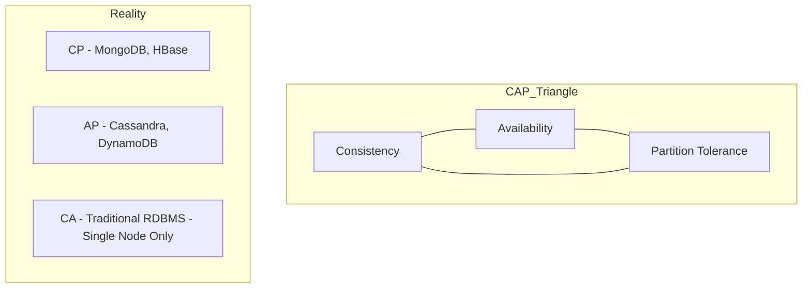

## 🧠 CONCEPT
The **CAP Theorem** (also known as Brewer's Theorem) states that it is impossible for a distributed data store to simultaneously provide more than two out of the following three guarantees:
1.  **Consistency (C)**: Every read receives the most recent write or an error.
2.  **Availability (A)**: Every request receives a (non-error) response, without the guarantee that it contains the most recent write.
3.  **Partition Tolerance (P)**: The system continues to operate despite an arbitrary number of messages being dropped (or delayed) by the network between nodes.

---

## ❓ WHY THIS EXISTS
- **Fundamental Limit**: It establishes the basic constraints of distributed systems.
- **Trade-off Decision**: Forces architects to choose between data correctness (C) and system uptime (A) during network failures (P).

---

## 📉 HARDWARE MAPPING
- **Network Latency**: The physical limit on how fast data can propagate across a network (speed of light).
- **Network Partition**: Hardware failures (switches, cables) or software misconfigurations that split a cluster.
- **Latency Impact**:
    - CP System: Infinite latency during partition (for unavailable nodes).
    - AP System: Zero additional latency, but serving stale data.

---

# ⚙️ INTERNAL MECHANICS

## 🔁 THE "P" MANDATE
In any distributed system, network partitions **will** happen. Therefore, we cannot "choose" to skip Partition Tolerance. The actual choice is:
- **CP (Consistency + Partition Tolerance)**: During a partition, the system refuses to serve requests if it cannot guarantee consistency.
- **AP (Availability + Partition Tolerance)**: During a partition, the system serves whatever data it has, even if it's stale.

## 🔍 PACELC EXTENSION
The **PACELC theorem** extends CAP by explaining what happens when there is **no partition**:
- **P** (In case of Partition) choose between **A** and **C**.
- **E** (Else/Normal operation) choose between **L** (Latency) and **C** (Consistency).

---

# 🏗️ ARCHITECTURE

---

# 🔗 CROSS-LAYER DEPENDENCIES
- **Upstream**: L1 Network (Probability of P depends on network reliability).
- **Downstream**: L3 Consistency Models (Stronger models require CP).
- **Adjacent**: Replication (Synchronous = CP-leaning, Asynchronous = AP-leaning).

---

# ⚖️ TRADE-OFFS
- **Consistency vs. Availability**: If you want 100% consistency, you must go offline if you can't reach all replicas.
- **Latency vs. Consistency (PACELC)**: Even without a partition, ensuring consistency across replicas adds round-trip time (RTT).

---

# 💥 FAILURE ANALYSIS

## 🔥 FAILURE TIMELINE (Network Partition)
- **T0**: Network switch between Rack 1 and Rack 2 fails.
- **T+1s**: Nodes in Rack 1 can't reach Nodes in Rack 2.
- **T+2s**: **In a CP System**: Nodes detect the partition; minority rack stops serving requests. **In an AP System**: Both racks continue serving requests independently.
- **Result**: CP prevents "Split Brain" but kills availability. AP allows "Split Brain" (data divergence).

## 🧨 FAILURE TYPES
- **Total Partition**: No communication between nodes.
- **Partial Partition**: Some nodes can see others, but not all (Network asymmetry).

---

# 🧠 CONSISTENCY & USER IMPACT
- **CP User Impact**: "Error: System unavailable. Please try again later."
- **AP User Impact**: "Success! (But user sees an old version of their profile)."

---

# ⚔️ ADVANCED TOPICS
- **Quorums**: Allowing a system to be "partially" CP or AP by tuning $R$ and $W$.
- **Distributed Consensus (Paxos/Raft)**: Algorithms used to maintain CP properties.
- **Conflict Resolution**: Required for AP systems once the partition is healed.

---

# 🌍 REAL-WORLD EXAMPLES
- **CP**: ZooKeeper, Etcd, HBase, MongoDB (default).
- **AP**: Cassandra, CouchDB, DynamoDB, Route 53 (DNS).
- **CA**: Non-existent in distributed systems (only single-node DBs like SQLite).

---

# ⚖️ COMPARISON
| Feature | CP System | AP System |
|---|---|---|
| Primary Goal | Correctness | Uptime |
| Scaling | Harder (Consensus overhead) | Easier (Independent nodes) |
| Conflict | None (Prevented) | Common (Resolved post-facto) |

---

# 🧠 DECISION HEURISTICS
- **Choose CP when**: Business logic requires strict correctness (e.g., Financial ledger, Inventory count).
- **Choose AP when**: System must be "always on" and stale data is acceptable (e.g., Social media feed, Product reviews).
