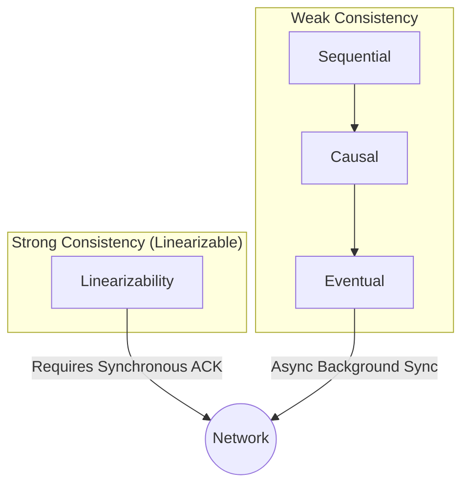

# 🧠 CONCEPT

The CAP Theorem and various Consistency Models define the fundamental trade-offs and safety guarantees in distributed systems. While CAP provides a high-level "impossibility" framework, Consistency Models provide a formal hierarchy of system behaviors from "Strong" (Linearizability) to "Weak" (Eventual Consistency).

---

## ❓ WHY THIS EXISTS

- **Network Reality:** Partitions (P) are inevitable in distributed systems.
- **Decision Framework:** CAP forces designers to choose between Consistency (C) and Availability (A) when a partition occurs.
- **Performance:** Consistency models like Eventual Consistency allow for higher performance by relaxing safety guarantees.

---

# ⚙️ INTERNAL MECHANICS

## 🔁 THE CAP THEOREM

- **Consistency (C):** Every successful read receives the most recent write (Linearizability).
- **Availability (A):** Every request receives a non-error response (regardless of staleness).
- **Partition Tolerance (P):** The system continues to operate despite dropped messages/network failure.

> **The Rule:** In a partitioned network (P), you must choose **either** C or A. You cannot have both.

## 📉 THE PACELC EXTENSION

If there is a **P**artition, choose between **A**vailability and **C**onsistency; **E**lse (normal operation), choose between **L**atency and **C**onsistency.

| Model | Partition Behavior | Normal Behavior | Example Systems |
| :--- | :--- | :--- | :--- |
| **PA/EL** | Available | Low Latency | DynamoDB, Cassandra |
| **PC/EC** | Consistent | High Consistency | BigTable, HBase, MongoDB |

## 🔍 CONSISTENCY HIERARCHY

| Model | Guarantee | User Intuition |
| :--- | :--- | :--- |
| **Linearizability** | Operations are instantaneous. | Reads always see the latest write globally. |
| **Sequential** | Global order exists; client order preserved. | Friends' posts are in order, but global order might vary. |
| **Causal** | Order preserved only for related events. | A reply always appears after the original comment. |
| **Eventual** | Replicas converge if writes stop. | "I'll see it eventually." High performance. |

---

# 🏗️ ARCHITECTURE

---

# 🔗 CROSS-LAYER DEPENDENCIES

- **Upstream:** L4 App logic must be "Idempotent" or handle "Conflict Resolution" when using Weak Consistency.
- **Downstream:** L1 Network latency determines the cost (L) in PACELC.

---

# ⚖️ TRADE-OFFS

- **Consistency vs. Latency:** Strong consistency requires multi-node coordination, increasing the "Read/Write Path" time.
- **Availability vs. Consistency:** During a DC outage, CP systems will refuse requests to ensure no stale data is served.

---

# 💥 FAILURE ANALYSIS

## 🔥 FAILURE TIMELINE (Linearizability Violation)

1. **T0:** Client 1 writes `X=10` to Leader (Node A).
2. **T1:** Node A ACKs the write to Client 1.
3. **T2:** Client 2 reads `X` from Follower (Node B) before the update has arrived.
4. **T3:** Node B returns `X=0` (Stale).

👉 **Violation:** Linearizability is broken because the read starting after the write completed saw an old value.
👉 **Fix:** Read from the Leader or use a Read Quorum $R+W > N$.

---

# 🌍 REAL-WORLD EXAMPLES

- **Zookeeper:** Provides **Sequential Consistency** for writes.
- **Spanner:** Provides **Linearizability** (External Consistency) using TrueTime.
- **Cassandra:** Often configured as **AP/EL** (Eventual Consistency).

---

# 🧠 DECISION HEURISTICS

- **Choose CP (Consistency):** For financial transactions, medical records, or distributed locking.
- **Choose AP (Availability):** For social media feeds, logging, or "add-to-cart" functionality.
- **Rule of Thumb:** Most user-facing web apps should be AP, while core metadata/banking systems must be CP.
