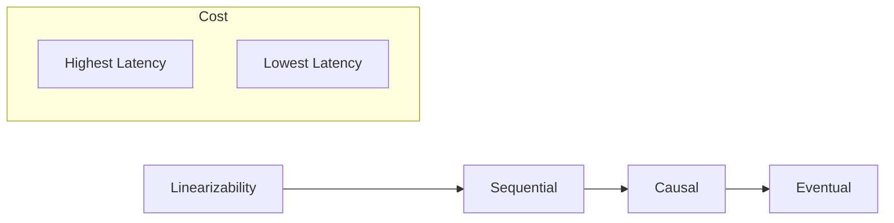

## 🧠 CONCEPT
**Consistency Models** are abstractions that define the rules for the visibility and ordering of updates in a distributed system. They provide a contract between the system and the developer regarding what value a read operation will return.

---

## ❓ WHY THIS EXISTS
- **Reasoning about Distributed State**: Without these models, it's impossible to predict how a cluster of nodes will behave under concurrent access.
- **Correctness vs. Performance**: Different applications need different levels of "truth" and are willing to pay different latency costs for it.

---

## 📉 HARDWARE MAPPING
- **Atomic Clock / NTP**: Used to order events, though physical clocks drift.
- **Speed of Light**: Limits how quickly a write on Node A can be "consistent" with Node B.
- **Latency Impact**:
    - Linearizability: Requires multiple RTTs (Consensus).
    - Eventual Consistency: Near-zero local latency.

---

# ⚙️ INTERNAL MECHANICS

## 🏆 THE SPECTRUM OF CONSISTENCY

| Model | Guarantee | User Experience |
|---|---|---|
| **Linearizability** (Strict) | Atomic, real-time ordering. | "I see exactly what was last written." |
| **Sequential** | Preserves per-client program order. | "My posts appear in order, but others' might vary." |
| **Causal** | Preserves cause-and-effect order. | "I see replies after the comments they reply to." |
| **Eventual** | Replicas eventually converge. | "I might see old data for a while." |

## 🔍 DATA FLOWS

### Linearizability
1. **Write** received by leader.
2. Leader gets **Quorum ACKs**.
3. **Read** must also check Quorum or Leader to ensure it's not reading a stale value before a previous write was fully committed.

### Causal Consistency
1. System tracks **Dependencies** (e.g., via Vector Clocks).
2. If Write B depends on Write A, no node will show B unless it has already shown A.

---

# 🏗️ ARCHITECTURE

---

# 🔗 CROSS-LAYER DEPENDENCIES
- **Upstream**: L3 CAP Theorem (Consistency choice defines A/P behavior).
- **Downstream**: L4 App Patterns (e.g., Commenting systems need Causal consistency).
- **Adjacent**: Isolation Levels (Consistency is about distributed replicas; Isolation is about concurrent transactions).

---

# ⚖️ TRADE-OFFS
- **Consistency vs. Latency**: Stronger models require more network round trips.
- **Consistency vs. Availability**: Linearizability is incompatible with high availability during partitions.

---

# 💥 FAILURE ANALYSIS

## 🔥 FAILURE TIMELINE (Stale Read in Eventual Consistency)
- **T0**: Alice updates her profile on Node A ($v=2$).
- **T+10ms**: Alice gets "Success".
- **T+50ms**: Bob reads Alice's profile from Node B. Node B hasn't received the update yet ($v=1$).
- **T+200ms**: Node A replicates to Node B.
- **Result**: Bob sees stale data for 150ms.

## 🧨 FAILURE TYPES
- **Clock Skew**: Causes Last-Write-Wins (LWW) to overwrite newer data with older data.
- **Network Lag**: Increases the "inconsistency window".

---

# 🧠 CONSISTENCY & USER IMPACT
- **Linearizability**: Crucial for bank balances and password changes.
- **Causal**: Crucial for conversation threads.
- **Eventual**: Acceptable for "likes", "view counts", and "DNS lookups".

---

# ⚔️ ADVANCED TOPICS
- **Vector Clocks**: Used to detect causal relationships without a global clock.
- **Linearizability vs. Serializability**: Linearizability is about single-object timing; Serializability is about multi-object transactions.
- **Read-Your-Writes**: A specific guarantee where a client always sees their own latest update.

---

# 🌍 REAL-WORLD EXAMPLES
- **Linearizable**: Etcd, ZooKeeper, Google Spanner (via TrueTime).
- **Causal**: MongoDB (optional), Bayou.
- **Eventual**: S3 (formerly), DNS, Cassandra.

---

# 🧠 DECISION HEURISTICS
- **Use Linearizability when**: The cost of a stale read is high (financial, security).
- **Use Causal Consistency when**: Ordering of related events matters (chat apps, dependency graphs).
- **Use Eventual Consistency when**: High write throughput and availability are more important than immediate global truth.
