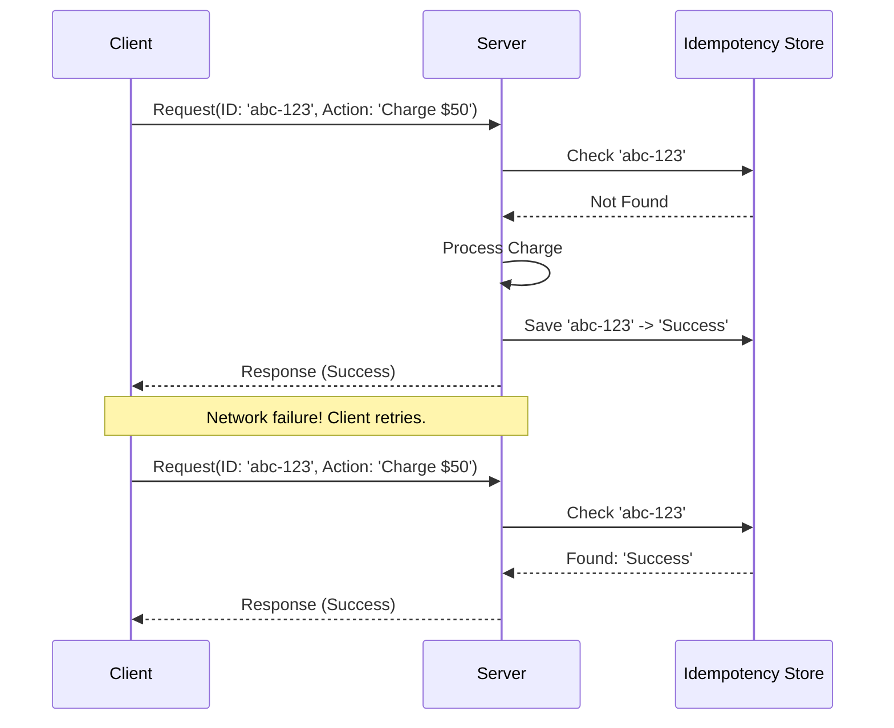

# 🧠 CONCEPT

Exactly-Once Semantics (EOS) is the guarantee that a message is processed exactly once, despite potential network failures, retries, and duplicate deliveries. While **exactly-once delivery** is physically impossible in an asynchronous network, **exactly-once processing** is achievable through specific architectural patterns.

---

## ❓ WHY THIS EXISTS

- **Network Instability:** Messages can be lost, delayed, or duplicated.
- **Side Effects:** Many operations (e.g., charging a credit card, sending an email, incrementing a counter) are not safe to repeat.
- **Reliability:** Users expect their actions to have predictable, singular outcomes.

---

# ⚙️ INTERNAL MECHANICS

## 🔁 DELIVERY SEMANTICS

| Semantic | Mechanism | Outcome |
| :--- | :--- | :--- |
| **At-Most-Once** | Send once; never retry. | Message may be lost; zero duplicates. |
| **At-Least-Once** | Retry until ACK received. | Message guaranteed delivered; duplicates likely. |
| **Exactly-Once** | At-Least-Once + De-duplication. | Message processed exactly once. |

## 🔍 ACHIEVING EXACTLY-ONCE PROCESSING

### 1. Idempotent Operations
An operation is idempotent if applying it multiple times has the same effect as applying it once.
- **Idempotent:** `Set(X, 10)`, `AddUserToGroup(ID)`, `DeleteFile(Path)`.
- **Non-Idempotent:** `IncrementCounter()`, `ChargeCustomer(Amount)`, `AppendToList(Value)`.

### 2. De-duplication (Distributed ID)
- **Mechanism:** Every request/message is tagged with a unique **Idempotency Key** (UUID) by the client.
- **Storage:** The server maintains a "Processed IDs" database (often with a TTL).
- **Process:**
    1. Server receives request.
    2. Check if ID exists in `ProcessedIDs`.
    3. If yes, return the cached result of the previous execution.
    4. If no, execute the operation, store the ID + Result, and return.

---

# 🏗️ ARCHITECTURE

---

# 🔗 CROSS-LAYER DEPENDENCIES

- **Upstream:** L4 Clients must generate and persist the idempotency key *before* the first attempt to survive client-side crashes.
- **Downstream:** L2 Storage must handle the atomic "Check-and-Set" for the idempotency key.

---

# ⚖️ TRADE-OFFS

- **Complexity:** Every stateful service must implement a de-duplication layer.
- **Storage Overhead:** Maintaining a history of processed IDs can be significant for high-throughput systems.
- **Garbage Collection:** Expiring old idempotency keys without causing late-duplicate issues (TTL management).

---

# 💥 FAILURE ANALYSIS

## 🔥 FAILURE TIMELINE (The "Two-Phase" Problem)

1. **T0:** Server processes the operation (e.g., changes DB state).
2. **T1:** Server attempts to record the Idempotency Key in the store.
3. **T2:** Server crashes before the key is recorded.
4. **T3:** Client retries.
5. **T4:** Server sees no key and processes the operation *again*.

👉 **Result:** Duplicate processing.
👉 **Fix:** The operation and the idempotency key storage must be **atomic** (e.g., in the same database transaction).

---

# 🌍 REAL-WORLD EXAMPLES

- **Stripe API:** Supports `Idempotency-Key` headers for all POST requests.
- **Kafka:** Supports idempotent producers and transactional writes (EOS) by tracking sequence numbers.
- **TCP:** Provides at-most-once delivery of data segments through sequence numbers and acknowledgments.

---

# 🧠 DECISION HEURISTICS

- **Default to At-Least-Once:** It is simpler and covers 90% of use cases where idempotency is natural (e.g., updating a profile).
- **Use De-duplication For:** Financial transactions, critical notifications, and external API calls that are not naturally idempotent.
- **Atomic Operations:** Always bundle the idempotency check/write with the state change if possible.
