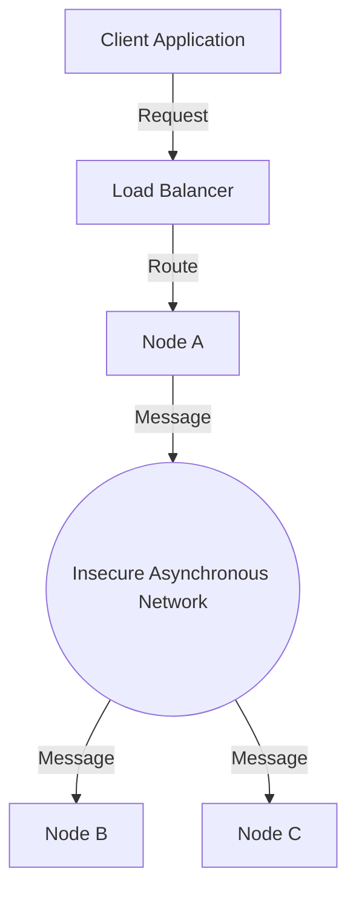

# 🧠 CONCEPT

A distributed system consists of multiple independent components (nodes) located on different networked computers, which communicate and coordinate their actions by passing messages to achieve a common goal. The core intuition is that a distributed system should appear as a single coherent system to its users, despite the underlying complexity of network asynchrony and partial failures.

---

## ❓ WHY THIS EXISTS

- **Scalability:** Single machines have physical limits (vertical scaling). Distributed systems allow horizontal scaling.
- **Reliability/Availability:** Avoiding single points of failure (SPOF).
- **Performance:** Bringing computation closer to users (Edge/CDN) and parallel processing.
- **Resource Sharing:** Utilizing specialized hardware across a network.

---

## 📉 HARDWARE MAPPING

Distributed systems are fundamentally constrained by the physics of data movement. The "Fallacies of Distributed Computing" stem from ignoring these physical realities.

| Resource | Latency (Approx) | Context |
| :--- | :--- | :--- |
| **L1 Cache** | ~0.5 ns | Local CPU |
| **RAM** | ~100 ns | Local Memory |
| **SSD (NVMe)** | ~10-100 µs | Local Storage |
| **Network (Same DC)** | ~500 µs | 0.5 ms round trip |
| **Network (Cross-Region)** | ~100-250 ms | Continental/Global |

**Impact:** A remote procedure call (RPC) is orders of magnitude slower than a local function call. Designing as if "Latency is zero" leads to catastrophic performance bottlenecks.

---

# ⚙️ INTERNAL MECHANICS

## 🔁 INTERACTION MODELS

### Synchronous Systems
- **Mechanism:** Nodes run in "rounds". Known upper bounds on message delay and processing time.
- **Reality:** Mostly theoretical; very hard to achieve in global networks like the Internet.

### Asynchronous Systems
- **Mechanism:** No upper bound on message delivery time. No global clock. Nodes run at independent rates.
- **Reality:** Most realistic model for modern cloud infrastructure.

## 🔍 CORRECTNESS MEASURES

1. **Safety:** "Nothing bad happens." (e.g., Two nodes never hold the same lock simultaneously).
2. **Liveness:** "Something good eventually happens." (e.g., A request eventually receives a response).

> **Trade-off:** In asynchronous systems with failures, it is often impossible to guarantee both absolute safety and absolute liveness (FLM impossibility).

---

# 🏗️ ARCHITECTURE

---

# 🔗 CROSS-LAYER DEPENDENCIES

- **Upstream:** L1 Network (TCP/UDP) determines the reliability and latency characteristics.
- **Downstream:** L4 App Patterns (Microservices, Sharding) rely on these foundations for correctness.
- **Adjacent:** L2 Storage (Distributed Databases) must handle the partial failures defined here.

---

# ⚖️ TRADE-OFFS

- **Complexity vs. Scalability:** Distributed systems are harder to debug and reason about (Concurrency, Asynchrony).
- **Safety vs. Liveness:** Under network partitions, you may have to sacrifice liveness (availability) to maintain safety (consistency).

---

# 💥 FAILURE ANALYSIS

## 🔥 FAILURE TIMELINE (RPC Timeout)

1. **T0:** Node A sends RPC request to Node B.
2. **T0+5ms:** Network switch experiences congestion; packet delayed.
3. **T0+100ms:** Node A's timeout expires.
4. **T0+101ms:** Node A assumes Node B is dead and triggers failover.
5. **T0+150ms:** Node B receives the original request and processes it (Side effect occurs).
6. **T0+200ms:** Node A receives "Success" from Node B's original request.

👉 **Result:** Split-brain or duplicate side effects if not idempotent.

## 🧨 FAILURE MODELS

| Model | Description | Detection |
| :--- | :--- | :--- |
| **Fail-stop** | Node halts permanently. | Easy (via Heartbeats) |
| **Crash** | Node halts silently. | Hard (undistinguishable from delay) |
| **Omission** | Node drops messages. | Very Hard |
| **Byzantine** | Arbitrary/Malicious behavior. | Extremely Complex (Requires BFT) |

---

# 🧠 CONSISTENCY & USER IMPACT

- **Partial Failures:** In a single-server app, it's "all or nothing." In DS, Node A might be up while Node B (database) is down.
- **Clock Skew:** Every node has a unique local clock. You cannot rely on timestamps alone for ordering events without sophisticated protocols (NTP, TrueTime, Logical Clocks).

---

# ⚔️ ADVANCED TOPICS

- **Logical Clocks (Lamport, Vector Clocks):** Ordering events without physical time.
- **Idempotency:** Essential for handling "Exactly-Once" semantics in the face of retries.
- **Consensus Protocols (Paxos, Raft):** Reaching agreement in a world of partial failures.

---

# 🌍 REAL-WORLD EXAMPLES

- **Google Spanner:** Uses **TrueTime API** (atomic clocks + GPS) to expose clock uncertainty and achieve external consistency globally.
- **AWS S3:** Uses replication across multiple Availability Zones (AZs) to survive "Crash" failures of entire data centers.
- **Ethereum/Bitcoin:** Designed to handle **Byzantine** failures where any node can be malicious.

---

# 🧠 DECISION HEURISTICS

- **Use Distributed Systems When:** You need scale beyond one machine or must survive regional outages.
- **Avoid When:** A single high-performance machine (Vertical Scaling) can handle the load. DS adds 10x complexity.
