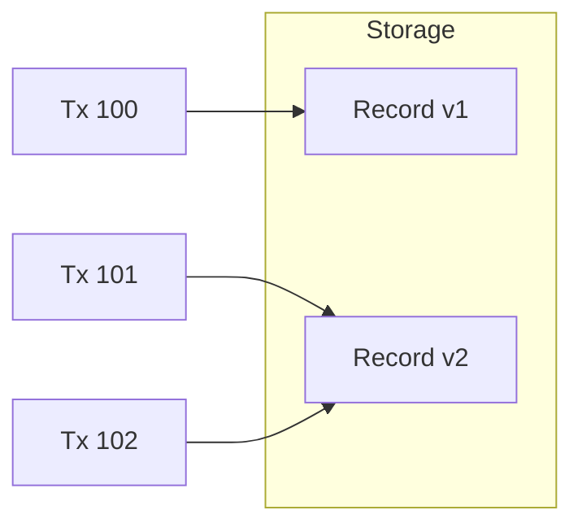

## 🧠 CONCEPT
**Isolation** is the "I" in ACID. It defines how transaction integrity is visible to other users and systems. Isolation levels determine the degree to which a transaction must be isolated from data modifications made by any other transaction.

---

## ❓ WHY THIS EXISTS
- **Concurrency Control**: Allows multiple users to access and modify the same data simultaneously without causing corruption.
- **Performance Trade-off**: Strong isolation (Serializability) is slow; weaker levels are faster but allow anomalies.

---

## 📉 HARDWARE MAPPING
- **CPU Locks**: Mutexes and semaphores used to implement locking.
- **RAM**: MVCC (Multi-Version Concurrency Control) stores multiple versions of data in memory/buffer pool.
- **Disk**: Lock tables and versioned pages stored on disk.

---

# ⚙️ INTERNAL MECHANICS

## 💥 THE ANOMALIES (What can go wrong)

| Anomaly | Description |
|---|---|
| **Dirty Write** | Transaction A overwrites an uncommitted value from Transaction B. |
| **Dirty Read** | Transaction A reads uncommitted data from Transaction B. |
| **Non-Repeatable Read** | Transaction A reads the same row twice and gets different data (because B committed an update). |
| **Phantom Read** | Transaction A runs a query twice and gets different sets of rows (because B inserted/deleted). |
| **Lost Update** | Two transactions read-modify-write; one overwrite is lost. |
| **Write Skew** | Two transactions read the same data but modify disjoint sets, violating a constraint (e.g., on-call doctors). |
| **Read Skew** | Seeing an inconsistent state across multiple objects (e.g., bank transfer partially visible). |

## 🏆 ISOLATION LEVELS (ANSI SQL Standard + Reality)

| Level | Prevents | Common Implementation |
|---|---|---|
| **Read Uncommitted** | Nothing (Allows Dirty Reads). | No locks. |
| **Read Committed** | Dirty Reads. | Snapshot of each query. |
| **Repeatable Read** | Non-repeatable Reads. | Snapshot for the whole transaction. |
| **Snapshot Isolation** | Most anomalies, including Lost Update. | MVCC. |
| **Serializable** | **All anomalies**, including Write Skew. | 2PL (Two-Phase Locking) or SSI. |

---

# 🏗️ ARCHITECTURE

### MVCC (Multi-Version Concurrency Control)
Instead of locking, the database keeps multiple versions of a record.
- Each transaction has a `timestamp` or `ID`.
- A transaction only sees versions created *before* it started.
- This allows **Reads to never block Writes**, and vice versa.

---

# 🔗 CROSS-LAYER DEPENDENCIES
- **Upstream**: L3 Consistency Models (Linearizability is similar to Serializability but in a distributed context).
- **Downstream**: L4 App Patterns (Choosing the right level for the business logic).
- **Adjacent**: Replication (Isolation within a single node vs. Consistency across nodes).

---

# ⚖️ TRADE-OFFS
- **Isolation vs. Concurrency**: Stronger isolation reduces the number of transactions that can run in parallel.
- **Complexity vs. Correctness**: Managing MVCC garbage collection or 2PL deadlocks adds significant system complexity.

---

# 💥 FAILURE ANALYSIS

## 🔥 FAILURE TIMELINE (Write Skew - The Doctor Case)
- **T0**: Alice and Bob are both on-call. Constraint: $\text{Count(on-call)} \ge 1$.
- **T+1ms**: Alice's Tx: `Select count(*) where on_call = true` $\rightarrow$ Result: $2$.
- **T+2ms**: Bob's Tx: `Select count(*) where on_call = true` $\rightarrow$ Result: $2$.
- **T+5ms**: Alice's Tx: `Update doctors set on_call = false where name = 'Alice'`.
- **T+6ms**: Bob's Tx: `Update doctors set on_call = false where name = 'Bob'`.
- **T+10ms**: Both commit.
- **Result**: Zero doctors on-call. This happens even in "Repeatable Read" level!

## 🧨 FAILURE TYPES
- **Deadlocks**: Two transactions waiting for each other's locks.
- **Aborts**: Optimistic concurrency control (OCC) failing due to high contention.

---

# 🧠 CONSISTENCY & USER IMPACT
- **Lost Update**: Can lead to financial loss or incorrect inventory.
- **Dirty Read**: Users might see "ghost" data that disappears on refresh.

---

# ⚔️ ADVANCED TOPICS
- **Two-Phase Locking (2PL)**: Growing phase (acquire locks) and Shrinking phase (release locks).
- **Serializable Snapshot Isolation (SSI)**: A modern, performant way to achieve serializability without heavy locking.
- **Predicate Locks**: Locking a "range" or "search condition" to prevent Phantoms.

---

# 🌍 REAL-WORLD EXAMPLES
- **PostgreSQL**: Default is Read Committed. Supports Serializable.
- **MySQL (InnoDB)**: Default is Repeatable Read.
- **Oracle**: Default is Read Committed.
- **Google Spanner**: External consistency (Serializability + Linearizability).

---

# 🧠 DECISION HEURISTICS
- **Use Read Committed when**: You need high performance and can handle occasional non-repeatable reads.
- **Use Repeatable Read / Snapshot Isolation when**: You need to prevent lost updates and want stable data throughout a transaction.
- **Use Serializable when**: Correctness is absolute (e.g., complex financial logic where write skew is possible).
