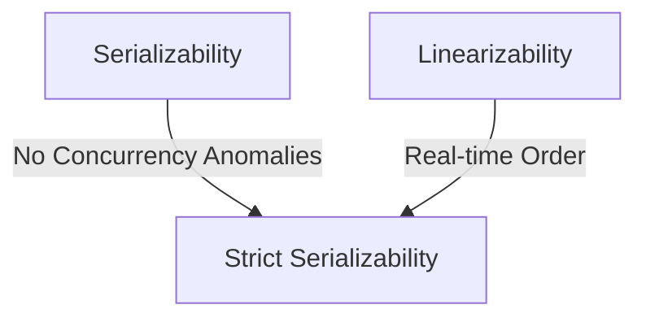

# 🧠 CONCEPT

Isolation is the "I" in ACID, ensuring that concurrent transactions do not interfere with each other. Isolation levels define the spectrum of concurrency allowed in a system by specifying which **Anomalies** (incorrect behaviors) are prevented.

---

## ❓ WHY THIS EXISTS

- **Concurrency:** Performance requires running multiple transactions simultaneously.
- **Data Integrity:** Preventing "interference" where one transaction's partial state is visible to another, leading to incorrect calculations or data corruption.
- **Developer Simplicity:** Stronger isolation (Serializability) allows developers to think of transactions as if they happen one after another.

---

# ⚙️ INTERNAL MECHANICS

## 🔍 THE ANOMALIES

| Anomaly | Description | Example |
| :--- | :--- | :--- |
| **Dirty Write** | Transaction A overwrites data written by uncommitted Transaction B. | Overwriting a value that is later rolled back. |
| **Dirty Read** | Transaction A reads data written by uncommitted Transaction B. | Reading a balance change before the transfer commits. |
| **Fuzzy Read** | Reading the same row twice and getting different values. | A conditional check fails because the value changed mid-transaction. |
| **Phantom Read** | A predicate query (e.g., `WHERE age > 20`) returns different rows. | Calculating an average while new rows are inserted. |
| **Lost Update** | Two transactions read/modify the same value; one update is lost. | Two people adding items to an inventory concurrently. |
| **Read Skew** | Seeing partial results of another transaction. | Seeing a transfer from Acc1 but not yet into Acc2. |
| **Write Skew** | Two transactions read the same data but update disjoint sets. | Two doctors on-call both quitting because they both see "2 doctors". |

---

## 🔁 ISOLATION LEVELS (Weakest to Strongest)

| Level | Prevents | Common Implementation |
| :--- | :--- | :--- |
| **Read Uncommitted** | Nothing | No locks. |
| **Read Committed** | Dirty Reads/Writes | Row-level locks or MVCC. |
| **Repeatable Read** | Fuzzy Reads | Snapshot-based reads. |
| **Snapshot Isolation** | Most anomalies except Write Skew | MVCC (Multi-Version Concurrency Control). |
| **Serializability** | All Anomalies | 2PL (Two-Phase Locking) or Serial Execution. |

---

# 🏗️ ARCHITECTURE: STRICT SERIALIZABILITY

**Strict Serializability** is the gold standard of correctness. It is the intersection of:
1. **Serializability:** No isolation anomalies.
2. **Linearizability:** Real-time ordering (Once a transaction commits, it is visible to everyone).

---

# 🔗 CROSS-LAYER DEPENDENCIES

- **Upstream:** L4 App logic must choose isolation levels based on the specific use case (e.g., Read Committed is usually fine for UI, but not for Bank Audits).
- **Downstream:** L2 Storage Engines (B-Trees, LSM-Trees) implement the locking and versioning (MVCC) required for isolation.

---

# ⚖️ TRADE-OFFS

- **Throughput vs. Safety:** Serializability drastically reduces the number of concurrent transactions the system can handle.
- **Complexity:** Implementing Snapshot Isolation (MVCC) requires managing multiple versions of the same data and performing garbage collection.

---

# 💥 FAILURE ANALYSIS

## 🔥 FAILURE TIMELINE (Write Skew Incident)

1. **T0:** Database has 2 Doctors On-Call: Alice and Bob.
2. **T1 (Transaction 1):** Alice queries "Count(On-Call)". Database returns 2.
3. **T2 (Transaction 2):** Bob queries "Count(On-Call)". Database returns 2.
4. **T3 (T1):** Alice updates her status to "Off-Call".
5. **T4 (T2):** Bob updates his status to "Off-Call".
6. **T5:** Both transactions commit (under Snapshot Isolation, they modified disjoint rows).

👉 **Result:** 0 Doctors on-call. Integrity constraint violated.
👉 **Fix:** Use `SERIALIZABLE` or explicit locking (`SELECT FOR UPDATE`).

---

# 🌍 REAL-WORLD EXAMPLES

- **PostgreSQL:** Default isolation level is **Read Committed**.
- **MySQL (InnoDB):** Default is **Repeatable Read**.
- **FoundationDB:** Provides **Strict Serializability** by default globally.

---

# 🧠 DECISION HEURISTICS

- **Use Read Committed:** For general-purpose web apps where slight staleness or fuzzy reads don't break the business.
- **Use Repeatable Read/Snapshot:** For analytics or reporting where you need a stable view of the data.
- **Use Serializable:** For financial movements, reservation systems (e.g., booking the last seat), and safety-critical state.
