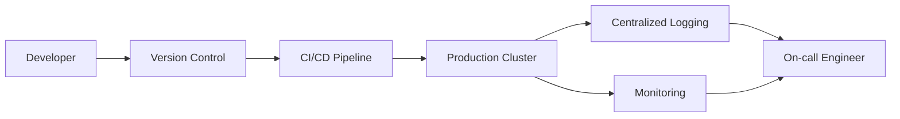

## 🧠 CONCEPT
**Maintainability** ($M$) is the ease with which a system can be modified to correct faults, improve performance, or adapt to a changed environment. It measures the "long-term health" of the codebase and operations.

### Underlying Aspects
1. **Operability**: Ease for operations teams to keep the system running smoothly.
2. **Lucidity (Simplicity)**: Ease for new engineers to understand the system (absence of "spaghetti code").
3. **Modifiability (Evolvability)**: Ease of adding new, unforeseen features without breaking existing ones.

---

## ❓ WHY THIS EXISTS
- **Software Lifecycle**: 80% of a system's cost occurs *after* the initial release (maintenance phase).
- **Engineering Velocity**: High maintainability allows teams to ship features faster with fewer regressions.
- **Operational Stability**: Well-maintained systems are easier to monitor, debug, and repair.

---

## 📉 HARDWARE MAPPING
- **Infrastructure as Code (IaC)**: Using Terraform/Ansible to make hardware setup maintainable and reproducible.
- **Monitoring/Logging**: Efficient disk usage for logs and memory for monitoring agents (e.g., Prometheus, Datadog).
- **Automation**: CI/CD pipelines reduce manual hardware/software deployment errors.
- **Latency Impact**:
    - Build time: ~5min - 30min (maintainability of the dev loop).
    - Mean Time to Detect (MTTD): ~1min - 5min (impact of good logging).

---

# ⚙️ INTERNAL MECHANICS

## 🔁 OPERATIONAL PATH (Healthy Maintenance)
1. **Developer** commits code to a **Git** repository.
2. **CI Pipeline** runs automated tests, linters, and security scans.
3. **CD Pipeline** deploys to a staging environment (Lucidity check).
4. **Monitoring Service** tracks key metrics (p99 latency, error rates).
5. **On-call Engineer** receives a clear, actionable alert if thresholds are breached (Operability).

## 🔍 DEBUGGING PATH
1. **Incident** occurs.
2. **Engineer** uses **Distributed Tracing** (e.g., Jaeger) to follow a request across microservices.
3. **Structured Logs** (JSON) allow for quick filtering and root cause analysis.
4. **Hotfix** is deployed via a rollback or "fix-forward" mechanism.

## ⏳ TIME & STATE GAPS
- **Technical Debt**: The "gap" between the current hacky implementation and the ideal maintainable architecture. If not managed, this gap grows until the system is unmodifiable.
- **Version Drift**: Different versions of a service running in production (can occur during rolling updates), making maintenance complex.

---

# 🏗️ ARCHITECTURE

---

# 🔗 CROSS-LAYER DEPENDENCIES
- **Upstream**: L3 Distributed Systems (Complexity of distributed state impacts maintainability).
- **Downstream**: L4 App Patterns (Clean architecture, SOLID principles).
- **Adjacent**: Documentation (The "soft" layer of maintainability).

---

# ⚖️ TRADE-OFFS
- **Maintenance vs. Speed**: Writing tests and documenting code takes time upfront but saves time in the long run.
- **Abstraction vs. Lucidity**: Over-abstracting code (to make it "evolvable") can make it harder to understand (reducing "lucidity").

---

# 💥 FAILURE ANALYSIS

## 🔥 FAILURE TIMELINE (Legacy Monolith Crash)
- **T0**: A bug is reported in the 10-year-old payment module.
- **T+1 hour**: No one on the current team knows how that module works (Low Lucidity).
- **T+4 hours**: A fix is attempted, but it breaks the "User Profile" module (Low Modifiability).
- **T+1 day**: System finally restored after a painful manual rollback.
- **Result**: High cost of maintenance due to poor architectural choices.

## 🧨 FAILURE TYPES
- **Dependency Hell**: Updating one library breaks ten others.
- **Zombie Code**: Features that are no longer used but still in the codebase, causing confusion.
- **Manual Toil**: Operations tasks that require human intervention (e.g., manual database backups).

---

# 🧠 CONSISTENCY & USER IMPACT
- **Zero-Downtime Deployments**: Blue-Green or Canary releases ensure that maintenance doesn't impact availability.
- **Predictable APIs**: Versioning (v1, v2) ensures that maintenance/refactoring doesn't break external clients.

---

# ⚔️ ADVANCED TOPICS
- **Distributed Tracing**: Visualizing requests as they flow through a complex system.
- **Chaos Engineering**: Intentionally breaking things to ensure the system is maintainable/operable under stress.
- **Test-Driven Development (TDD)**: Ensuring every line of code is maintainable and verified.
- **Observability**: Beyond monitoring; the ability to answer *why* something is happening from external outputs.

---

# 🌍 REAL-WORLD EXAMPLES
- **Kubernetes**: Standardized API for managing containerized apps (High Operability).
- **GitHub**: Uses extensive CI/CD to maintain a massive Ruby on Rails monolith.
- **Spinnaker**: Multi-cloud continuous delivery platform.

---

# ⚖️ COMPARISON
| Feature | High Maintainability | Low Maintainability |
|---|---|---|
| Deployment | Automated (One-click) | Manual (Nerve-wracking) |
| Debugging | Traceable (Jaeger/Logs) | Guesswork (SSH into boxes) |
| Codebase | Clean/Modular | Spaghettified/Monolithic |
| On-call | Rare/Quiet | Frequent/Stressful |

---

# 🧠 DECISION HEURISTICS
- **Invest in Maintainability when**:
    - The project is expected to last more than 6 months.
    - More than 3 engineers are working on the same codebase.
    - The cost of an outage is high.
- **Accept Lower Maintainability for**:
    - Quick prototypes / MVPs (but with a plan to refactor).
    - Scripts that will be run only once.
