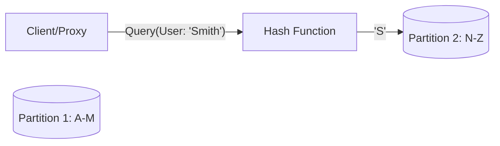

# 🧠 CONCEPT

Partitioning (or Sharding) is the process of splitting a large dataset into multiple smaller, manageable subsets (partitions) and distributing them across different nodes. This is the primary mechanism for horizontal scaling in distributed databases.

---

## ❓ WHY THIS EXISTS

- **Scalability:** Overcomes the storage and throughput limits of a single machine.
- **Performance:** Parallelizes queries and reduces the dataset size per node, potentially improving cache hit rates.
- **Availability:** Failure of one partition only affects a subset of the data.

---

# ⚙️ INTERNAL MECHANICS

## 🔁 STRATEGIES

### 1. Vertical Partitioning
- **Logic:** Splitting tables by columns.
- **Example:** Moving "User Bio" and "Profile Picture URL" to a separate table/service from "User Login Credentials".
- **Pros:** Optimizes storage for different access patterns.
- **Cons:** Joins across partitions are expensive and complex.

### 2. Horizontal Partitioning (Sharding)
- **Logic:** Splitting tables by rows. Every partition has the same schema but different rows.

| Strategy | Mechanism | Pros | Cons |
| :--- | :--- | :--- | :--- |
| **Range Partitioning** | Data split by value ranges (e.g., A-M, N-Z). | Supports range queries efficiently. | **Hotspots** (e.g., all surnames starting with 'S'). |
| **Hash Partitioning** | `node = hash(key) % n`. | Uniform data distribution. | Re-sharding when `n` changes requires massive data movement. |
| **Consistent Hashing** | Map keys and nodes onto a logical ring. | Minimizes data movement during re-sharding. | Can be imbalanced without "virtual nodes". |

---

## 🔍 CONSISTENT HASHING DEEP DIVE

Consistent hashing maps both nodes and keys to a large circular space (the "Ring", e.g., 0 to 2^32-1).

1. **Write Path:**
   - Hash the `Partition Key`.
   - Locate the position on the ring.
   - Walk clockwise until the first node is found. That is the owner.
2. **Re-sharding:**
   - **Adding Node:** Only the keys that hash to the space between the new node and its counter-clockwise predecessor need to move.
   - **Removing Node:** Only the keys owned by the removed node move to its clockwise successor.

**Virtual Nodes (VNodes):** To prevent imbalance, each physical node is hashed multiple times to different locations on the ring. This ensures that if a node fails, its load is distributed across *multiple* successors, not just one.

---

# 🏗️ ARCHITECTURE

---

# 🔗 CROSS-LAYER DEPENDENCIES

- **Upstream:** L4 App logic must choose an effective **Shard Key**. A poor key choice (e.g., `timestamp`) leads to write hotspots.
- **Downstream:** L2 Storage Engines handle the physical files for each partition.

---

# ⚖️ TRADE-OFFS

- **Query Complexity:** Queries not using the shard key must "scatter-gather" (query all nodes), which is extremely slow.
- **Transactional Integrity:** Cross-shard transactions (Atomic updates to data in P1 and P2) require complex protocols like Two-Phase Commit (2PC).

---

# 💥 FAILURE ANALYSIS

## 🔥 FAILURE TIMELINE (Hotspot Melt-down)

1. **T0:** A celebrity (e.g., 'Zuck') starts a live stream.
2. **T0+1s:** Millions of users query the partition holding 'Zuck's' metadata.
3. **T0+5s:** CPU usage on Partition 7 hits 100%. Latency spikes.
4. **T0+10s:** Requests queue up; memory is exhausted. Node 7 crashes.
5. **T0+11s:** Load balancer redirects traffic to replicas or other nodes (if using consistent hashing without care), potentially cascading the failure.

👉 **Prevention:** Use a more granular shard key or implement "hotspot sharding" (splitting the hot key across multiple sub-partitions).

---

# 🌍 REAL-WORLD EXAMPLES

- **Google BigTable:** Uses Range Partitioning (SSTables) for efficient scanning of lexicographically sorted data.
- **Apache Cassandra:** Uses Consistent Hashing to distribute rows across a cluster without a central coordinator for partitioning.
- **Vitess:** A database clustering system for horizontal scaling of MySQL through sharding.

---

# 🧠 DECISION HEURISTICS

- **Shard Key Selection:** Choose a key that is used in the majority of queries and has high cardinality (many unique values).
- **Avoid:** Sharding based on time if you have a high write volume, as all writes will hit the "current time" shard.
