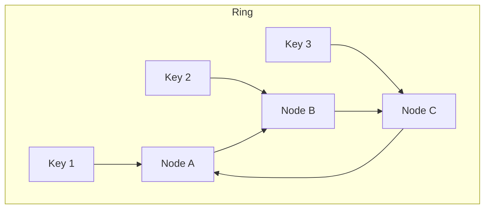

## 🧠 CONCEPT
**Partitioning** (or **Sharding**) is the process of splitting a large dataset into smaller, manageable chunks called "shards" and distributing them across multiple nodes in a network. Each node becomes responsible for a subset of the total data.

---

## ❓ WHY THIS EXISTS
- **Scalability**: A single node has finite CPU, RAM, and Disk. Partitioning allows a system to scale horizontally by adding more nodes.
- **Performance**: Reduces the size of indexes and datasets on each node, speeding up queries.
- **Availability**: A failure in one shard doesn't necessarily take down the entire system (though it affects a subset of data).

---

## 📉 HARDWARE MAPPING
- **Disk IOPS**: Distributed across nodes, preventing a single disk from becoming a bottleneck.
- **Memory**: Each node only needs to cache its own shard's hot data.
- **Network**: Intra-cluster traffic for rebalancing and cross-shard queries.
- **Real Latency**:
    - Single shard lookup: ~1ms (local DB).
    - Cross-shard scatter-gather: ~10ms - 100ms (due to tail latency of the slowest node).

---

# ⚙️ INTERNAL MECHANICS

## 🔁 WRITE PATH (Hash Partitioning)
1. **Client** sends write request with key $K$.
2. **Routing Tier** calculates $P = \text{hash}(K) \mod N$ (where $N$ is the number of shards).
3. Request routed to **Node** responsible for partition $P$.
4. Node appends to its local **WAL** and updates state.
5. **ACK** returned to client.

## 🔍 READ PATH
1. **Point Query**: Client provides key $K$. Router finds partition $P$ and queries one node.
2. **Range Query**:
    - **Range Partitioned**: Efficient if the range falls within one shard.
    - **Hash Partitioned**: Requires "Scatter-Gather" (querying all shards and merging results), which is slow.

## ⏳ TIME & STATE GAPS
- **Rebalancing Window**: When a shard is moved from Node A to Node B, there is a gap where Node A may still receive writes that need to be forwarded or buffered.
- **Secondary Index Staleness**: If global secondary indexes are used, there's a lag between the primary write and the index update.

---

# 🏗️ ARCHITECTURE

### Consistent Hashing (The Ring)
Consistent hashing maps both nodes and data keys onto a logical ring ($0$ to $2^n-1$).
- **Virtual Nodes**: Each physical node is assigned multiple points on the ring to ensure uniform distribution and prevent "hotspots".

---

# 🔗 CROSS-LAYER DEPENDENCIES
- **Upstream**: L1 Network (Latency of internal RPCs).
- **Downstream**: L2 Storage (Local DB performance).
- **Adjacent**: Replication (each shard is usually replicated for HA).

---

# ⚖️ TRADE-OFFS
- **Complexity vs. Scalability**: Manual sharding is hard to manage; automated sharding (e.g., Vitess for MySQL) adds architectural complexity.
- **Query Flexibility vs. Write Distribution**: Range partitioning allows fast range queries but causes hotspots (e.g., all "A" names on one node). Hash partitioning balances writes but kills range query performance.

---

# 💥 FAILURE ANALYSIS

## 🔥 FAILURE TIMELINE (Hot Shard)
- **T0**: Viral event causes 100x traffic to Key $K$ (e.g., a specific tweet).
- **T+5s**: Node A (holding Shard $P$) hits 100% CPU.
- **T+10s**: Ingress queue on Node A overflows; all requests to Node A (even for other keys in that shard) fail.
- **T+30s**: Load balancer marks Node A unhealthy.
- **Result**: Data in Shard $P$ is unavailable until traffic subsides or the shard is split.

## 🧨 FAILURE TYPES
- **Hotspots**: Uneven data/traffic distribution.
- **Split Brain**: During rebalancing, two nodes think they own the same shard.
- **Resharding Failure**: Moving TBs of data between nodes can saturate network links and crash production traffic.

---

# 🧠 CONSISTENCY & USER IMPACT
- **Cross-Shard Transactions**: Extremely difficult and usually avoided (requires 2PC/Paxos), impacting user consistency.
- **Local Secondary Indexes**: User might see their data but it doesn't show up in search results immediately.

---

# ⚔️ ADVANCED TOPICS
- **Consistent Hashing**: Minimizes data movement during node additions (only $1/N$ data moves).
- **Virtual Nodes**: Solves the "heterogeneous hardware" problem (give more powerful nodes more virtual slots).
- **Service Discovery (ZooKeeper/Etcd)**: Maintains the "Partition Map" so clients know where to go.

---

# 🌍 REAL-WORLD EXAMPLES
- **Cassandra**: Uses consistent hashing and peer-to-peer partitioning.
- **MongoDB**: Supports "Ranged Sharding" and "Hashed Sharding".
- **HBase**: Uses range-based partitioning (RegionServers).
- **Elasticsearch**: Uses fixed number of shards defined at index creation.

---

# ⚖️ COMPARISON
| Method | Distribution | Range Query | Rebalancing Ease |
|---|---|---|---|
| **Range** | Poor (Hotspots) | Excellent | High |
| **Hash (Mod N)** | Good | Terrible | Low (Massive movement) |
| **Consistent Hashing** | Good | Terrible | High |

---

# 🧠 DECISION HEURISTICS
- **Use Range Partitioning when**: Range queries are the primary access pattern (e.g., Time-series data).
- **Use Hash/Consistent Hashing when**: Uniform write distribution is critical and access is mostly by primary key.
- **Use Virtual Nodes** to handle unbalanced clusters or different server capacities.
