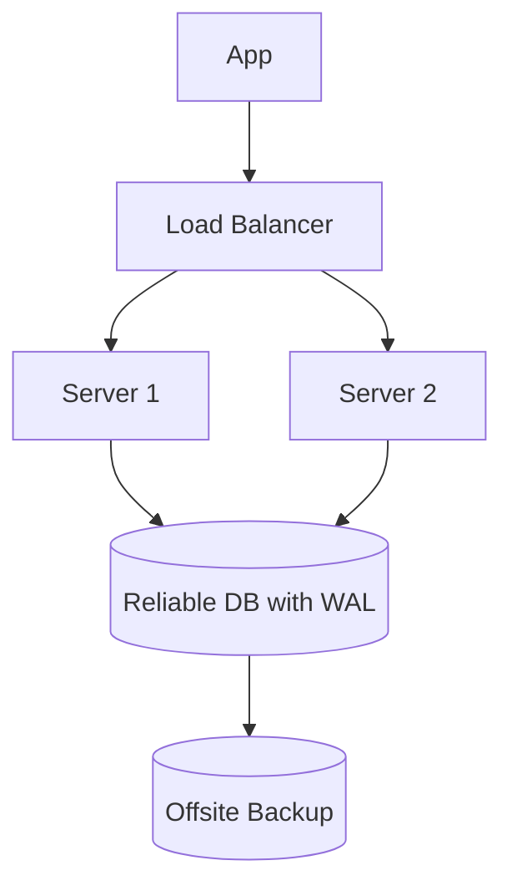

## 🧠 CONCEPT
**Reliability** ($R$) is the probability that a system will perform its intended function correctly for a specified duration under given operating conditions. While availability measures "up-time," reliability measures "correctness" and "consistency of performance."

### Key Metrics
- **MTBF (Mean Time Between Failures)**: Average time between one failure and the next. Higher is better.
  $$MTBF = \frac{\text{Total Time} - \text{Downtime}}{\text{Number of Failures}}$$
- **MTTR (Mean Time To Repair)**: Average time to restore service after a failure. Lower is better.
  $$MTTR = \frac{\text{Total Maintenance Time}}{\text{Number of Repairs}}$$

---

## ❓ WHY THIS EXISTS
- **Data Integrity**: Reliable systems ensure that data is not corrupted or lost during processing.
- **Predictability**: Users expect consistent behavior (e.g., a bank transfer should always either complete or fail safely).
- **Safety**: In critical systems (medical, aerospace), reliability is a life-and-death requirement.

---

## 📉 HARDWARE MAPPING
- **Memory**: ECC (Error Correction Code) RAM prevents bit-flips from causing crashes or silent data corruption.
- **Disk**: Checksums (ZFS, Btrfs) and RAID protect against latent sector errors.
- **Network**: TCP retries and checksums ensure reliable delivery of packets.
- **Latency Impact**:
    - Checksum calculation: ~μs
    - Retransmission timeout (RTO): ~200ms - 1s

---

# ⚙️ INTERNAL MECHANICS

## 🔁 WRITE PATH (Reliable Pattern)
1. **Client** initiates transaction.
2. **Application** performs validation and idempotency checks.
3. **Database** writes to Write-Ahead Log (WAL) before updating data pages.
4. **Sync Replication**: Wait for ACKs from replicas before confirming to client.
5. **Atomic Commit**: Ensure all parts of the write succeed or none do.

## 🔍 READ PATH
1. **Client** requests data.
2. **System** performs integrity checks (checksums).
3. **Consensus Read**: In distributed systems, query multiple nodes to ensure the version is current and consistent.

## ⏳ TIME & STATE GAPS
- **Silent Data Corruption**: Data that is corrupted but not detected for a long time (weeks/months) until a read occurs.
- **Heisenbugs**: Non-deterministic bugs that appear only under specific timing or load conditions, impacting perceived reliability.

---

# 🏗️ ARCHITECTURE

---

# 🔗 CROSS-LAYER DEPENDENCIES
- **Upstream**: L2 Storage (ACID properties depend on disk write persistence).
- **Downstream**: L4 App Patterns (Idempotency and retry logic handle underlying L3 unreliability).
- **Adjacent**: Monitoring (identifies reliability regressions).

---

# ⚖️ TRADE-OFFS
- **Reliability vs. Latency**: Adding checksums, retries, and synchronous replication increases the time taken to complete a request.
- **Reliability vs. Complexity**: Building "Exactly-Once" semantics or fault-tolerant consensus (Raft) is significantly more complex than "At-Most-Once" delivery.

---

# 💥 FAILURE ANALYSIS

## 🔥 FAILURE TIMELINE (Silent Disk Corruption)
- **T0**: A bit flips on the disk due to cosmic rays.
- **T+1 week**: A background "scrubbing" process reads the block.
- **T+1 week + 10ms**: Checksum mismatch detected.
- **T+1 week + 100ms**: System automatically restores the block from a redundant replica.
- **Result**: Failure prevented from impacting the user (High Reliability).

## 🧨 FAILURE TYPES
- **Hardware Faults**: Disk crashes, memory corruption.
- **Software Bugs**: Memory leaks, race conditions.
- **Human Error**: Misconfiguration of firewalls or databases.

---

# 🧠 CONSISTENCY & USER IMPACT
- **Idempotency**: Critical for reliability; allows clients to safely retry failed requests without duplicate side-effects.
- **Transaction Isolation**: Prevents anomalies (dirty reads, lost updates) that compromise system reliability.

---

# ⚔️ ADVANCED TOPICS
- **Idempotency Keys**: Unique tokens provided by clients to ensure a request is processed exactly once.
- **Exponential Backoff**: Strategy for retrying failed requests to avoid overwhelming a struggling system (Self-healing).
- **Circuit Breakers**: Stops calls to a failing downstream service to prevent cascading failures.
- **Write-Ahead Logging (WAL)**: Ensures that even if a node crashes mid-operation, the intent is preserved and can be recovered.

---

# 🌍 REAL-WORLD EXAMPLES
- **PostgreSQL**: Strong ACID compliance and WAL-based recovery.
- **TCP Protocol**: Provides a reliable stream over an unreliable network (IP).
- **Kafka**: Reliable message delivery via replication and persistent logs.

---

# ⚖️ COMPARISON
| Mechanism | Reliability Benefit | Latency Cost |
|---|---|---|
| No Replication | Low | None |
| Async Replication | Medium | Low |
| Sync Replication | High | High |

---

# 🧠 DECISION HEURISTICS
- **Prioritize Reliability (Sync/ACID) when**: Data loss is unacceptable (e.g., Financial transactions, medical records).
- **Prioritize Speed (Async/At-most-once) when**: Occasional loss or staleness is acceptable for the sake of throughput (e.g., Log collection, social media likes).
