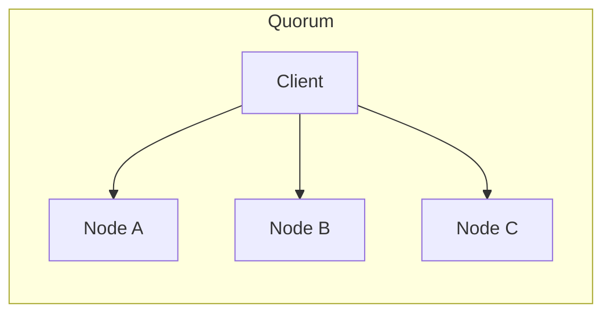

## 🧠 CONCEPT
**Replication** is the practice of keeping multiple copies of the same data on different machines, usually connected via a network. It ensures that if one machine fails, the data remains accessible from others.

---

## ❓ WHY THIS EXISTS
- **High Availability**: Keeps the system running even if one (or more) nodes fail.
- **Latency Reduction**: Placing data geographically closer to users (CDNs).
- **Scalability**: Increases the number of nodes that can serve read requests.

---

## 📉 HARDWARE MAPPING
- **Network Bandwidth**: Replicating data (especially synchronously) consumes significant internal network capacity.
- **Disk Space**: Multiplied by the replication factor (e.g., $3\text{x}$ replication $= 300\text{GB}$ for $100\text{GB}$ data).
- **CPU**: Processing replication logs and managing consensus.
- **Real Latency**:
    - Synchronous Replication (Local DC): ~1ms - 5ms.
    - Asynchronous Replication (Cross-region): ~50ms - 500ms.

---

# ⚙️ INTERNAL MECHANICS

## 🔁 WRITE PATH (Single Leader)
1. **Client** sends write to **Leader**.
2. **Leader** writes to local storage (WAL).
3. **Propagation**:
    - **Synchronous**: Leader waits for $N$ replicas to ACK before replying to client.
    - **Asynchronous**: Leader replies immediately after local write; replicas pull/receive updates later.
4. **ACK** to Client.

## 🔍 READ PATH
1. **Client** can query **Leader** (Strong Consistency) or **Followers** (Eventual Consistency).
2. **Read-your-writes**: If a client writes to the leader and then reads from a lagging follower, they may see stale data.

## ⏳ TIME & STATE GAPS
- **Replication Lag**: The delay between a write on the leader and its appearance on a follower. This lag can grow under high load.
- **Failover Downtime**: The time taken to detect a leader crash and elect a new one.

---

# 🏗️ ARCHITECTURE

### Leader-Follower (Master-Slave)
One leader handles all writes. Multiple followers handle reads.
- **Pros**: Simplifies consistency; easy to scale reads.
- **Cons**: Leader is a write bottleneck and SPOF for writes.

### Leaderless (Quorum-based)
Any node can handle writes and reads. Uses $w + r > n$ to guarantee overlap.
- **Pros**: High availability; survives multiple node failures.
- **Cons**: Complex conflict resolution; no global ordering.

---

# 🔗 CROSS-LAYER DEPENDENCIES
- **Upstream**: L3 CAP Theorem (Consistency vs. Availability choice).
- **Downstream**: L2 Storage (Write-Ahead Logs for durability).
- **Adjacent**: Partitioning (usually every shard is a replication group).

---

# ⚖️ TRADE-OFFS
- **Consistency vs. Performance**: Synchronous replication ensures consistency but adds the latency of the slowest follower to every write.
- **Durability vs. Availability**: If you require too many ACKs (high $W$), the system becomes unavailable if a few nodes go down.

---

# 💥 FAILURE ANALYSIS

## 🔥 FAILURE TIMELINE (Leader Crash)
- **T0**: Leader crashes.
- **T+5s**: Followers detect missing heartbeats.
- **T+10s**: **Leader Election** (Raft/Paxos) begins.
- **T+15s**: New leader elected.
- **T+16s**: System resumes handling writes.
- **Result**: Data loss if the crash happened after an async write was ACKed but before it was replicated.

## 🧨 FAILURE TYPES
- **Network Partition**: Replicas can't talk, leading to "Split Brain" (two leaders).
- **Stale Reads**: Follower is too far behind the leader.
- **Cascading Failure**: One replica fails, increasing load on others, causing them to fail.

---

# 🧠 CONSISTENCY & USER IMPACT
- **Eventual Consistency**: Replicas will eventually converge, but users might see old data temporarily.
- **Monotonic Reads**: Ensures a user doesn't see data "go back in time" after refreshing.
- **Read-After-Write**: Ensuring a user always sees their own updates.

---

# ⚔️ ADVANCED TOPICS
- **Quorums ($R + W > N$)**: Tuning $R$ and $W$ to balance read/write performance.
- **Conflict Resolution**:
    - **LWW (Last Write Wins)**: Simple but risky.
    - **CRDTs (Conflict-free Replicated Data Types)**: Mathematically guaranteed convergence.
- **Anti-Entropy**: Background processes (e.g., using Merkle Trees) to fix inconsistencies between replicas.

---

# 🌍 REAL-WORLD EXAMPLES
- **MySQL Replication**: Supports both semi-sync and async.
- **DynamoDB/Cassandra**: Leaderless, quorum-based replication.
- **Kafka**: Uses a leader per partition with "In-Sync Replicas" (ISR).

---

# ⚖️ COMPARISON
| Feature | Single Leader | Multi-Leader | Leaderless |
|---|---|---|---|
| Write Scalability | Poor | Good | Excellent |
| Complexity | Low | High | High |
| Conflicts | None | Common | Common |
| Failover | Automatic/Manual | Not needed | Not needed |

---

# 🧠 DECISION HEURISTICS
- **Use Single Leader when**: Strong consistency and simple transactional semantics are required (e.g., traditional SQL).
- **Use Leaderless when**: Highest availability and write throughput are needed, and the application can handle eventual consistency (e.g., shopping carts, metrics).
- **Use Multi-Leader when**: You need to handle writes across multiple data centers or during offline operations.
