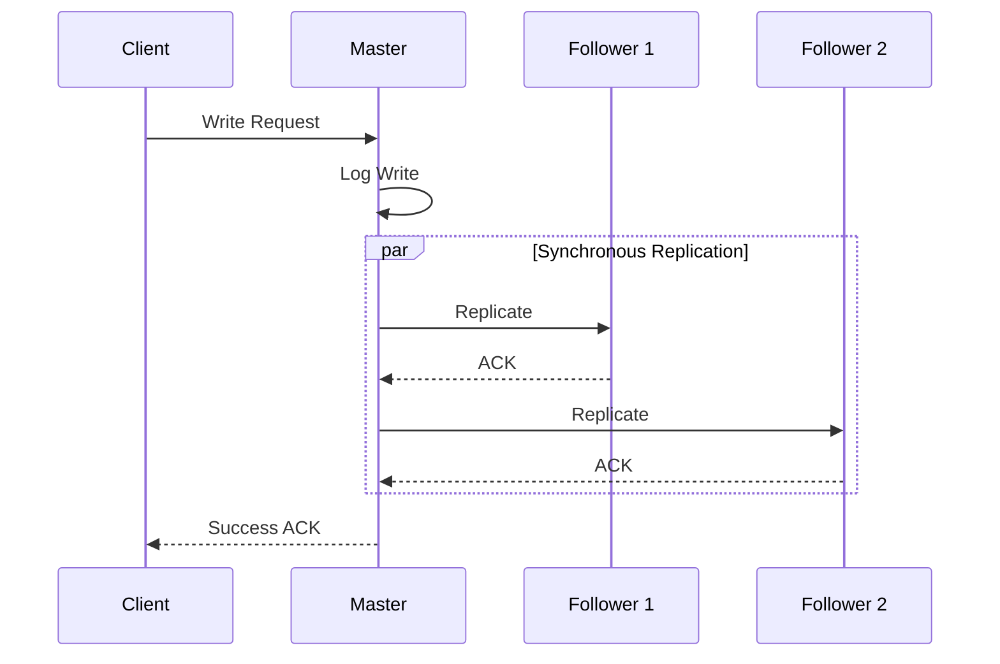

# 🧠 CONCEPT

Replication is the process of maintaining multiple copies of the same data across different nodes. Its primary goal is **High Availability (HA)** and **Durability**. Quorums are a mechanism to ensure consistency across these replicas by requiring a minimum number of nodes to agree on an operation.

---

## ❓ WHY THIS EXISTS

- **High Availability:** If one replica fails, the system remains functional using other replicas.
- **Read Scalability:** Read requests can be distributed across multiple read-only followers.
- **Durability:** Protects against data loss due to hardware failure.
- **Reduced Latency:** Placing replicas geographically closer to users (Edge computing).

---

# ⚙️ INTERNAL MECHANICS

## 🔁 REPLICATION MODELS

### 1. Single-Master (Primary-Backup)
- **Mechanism:** One "Master" handles all writes. Multiple "Followers" handle reads.
- **Propagation:**
    - **Synchronous:** Master waits for ACK from all followers before responding to client. (High Durability/Consistency, Low Performance).
    - **Asynchronous:** Master responds immediately after local write. (High Performance, Risk of data loss/stale reads).

### 2. Multi-Master (Multi-Primary)
- **Mechanism:** Multiple nodes accept writes.
- **Conflict Resolution:** Essential as different nodes might receive conflicting updates concurrently.
    - **LWW (Last Write Wins):** Uses timestamps (risk of clock skew issues).
    - **Causal Tracking:** Uses Vector Clocks/Lamport Timestamps to track "happened-before" relationships.
    - **Client-Side:** Application/User merges versions (e.g., Shopping Cart).

## 🔍 QUORUMS (N, W, R)

To maintain consistency in a system with $N$ replicas:
- **W (Write Quorum):** Number of nodes that must acknowledge a write.
- **R (Read Quorum):** Number of nodes that must be queried for a read.

**Formula for Strong Consistency:**  $R + W > N$
*Intuition: The read and write sets must overlap by at least one node.*

| Configuration | Behavior |
| :--- | :--- |
| **W=N, R=1** | Fast reads, slow/fragile writes (any node failure blocks writes). |
| **W=1, R=N** | Fast writes, slow/fragile reads (any node failure blocks reads). |
| **W=Q, R=Q** (Q = N/2 + 1) | Balanced. Can tolerate $(N-Q)$ failures. |

---

# 🏗️ ARCHITECTURE

---

# 🔗 CROSS-LAYER DEPENDENCIES

- **Upstream:** L4 App must handle "Eventual Consistency" if $R + W \leq N$.
- **Downstream:** L1 Network stability determines replication lag.

---

# ⚖️ TRADE-OFFS

- **Consistency vs. Latency:** Synchronous replication ensures consistency but adds network round-trip time (RTT) to every write.
- **Availability vs. Consistency:** During a network partition, quorums may not be reachable, forcing a choice between failing the request (Consistency) or allowing stale data (Availability).

---

# 💥 FAILURE ANALYSIS

## 🔥 FAILURE TIMELINE (Leader Election / Failover)

1. **T0:** Master node crashes.
2. **T0+5s:** Followers detect heartbeat loss.
3. **T0+6s:** Election starts. Followers vote for a new leader based on log completeness.
4. **T0+10s:** New Master elected.
5. **T0+11s:** System resumes accepting writes.

👉 **Gaps:** During [T0, T10], writes are rejected. If the old Master comes back (Split-brain), it must be fenced or forced to step down to prevent data corruption.

---

# 🌍 REAL-WORLD EXAMPLES

- **MySQL/PostgreSQL:** Standard Single-Master replication (Async/Semi-Sync).
- **Cassandra:** Leaderless architecture using tunable Quorums ($R, W, N$ configurable per query).
- **DynamoDB:** Uses Multi-master with conflict resolution for extreme availability.
- **Raft/Paxos:** Consensus algorithms used to manage the "Leader Election" and "Log Replication" safely.

---

# 🧠 DECISION HEURISTICS

- **Read-Heavy App:** Use Single-Master with many Async Followers.
- **Global Write Availability:** Use Multi-Master with conflict resolution (e.g., CRDTs).
- **Strict Data Integrity:** Use Quorums with $R + W > N$ and Synchronous Replication.
