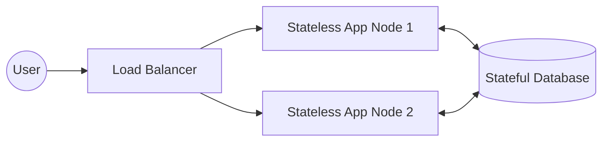

# 🧠 CONCEPT

In distributed systems, the absence of a global clock and the presence of network asynchrony make it impossible to distinguish between a "slow" node and a "crashed" node. Safety guarantees (Atomicity, Consistency, Isolation) provide the framework for predictable behavior despite these challenges.

---

## ❓ WHY THIS EXISTS

- **Failure Ambiguity:** To prevent the system from hanging indefinitely while waiting for a response from a node that may have crashed.
- **Data Integrity:** Ensuring that partial failures (where only some nodes update) don't leave the system in an inconsistent state.
- **Predictability:** Providing "Safety Guarantors" (Atomicity, Consistency, Isolation) so developers can reason about system state.

---

# ⚙️ INTERNAL MECHANICS

## 🔁 FAILURE DETECTION (TIMEOUTS)

Timeouts are the primary mechanism for failure detection in asynchronous systems. They impose an artificial upper bound on delay.

### The Timeout Trade-off
- **Small Timeout:** Faster detection of failures, but higher risk of "False Positives" (declaring a healthy but slow node as dead).
- **Large Timeout:** High accuracy (fewer false positives), but the system wastes time waiting for actually crashed nodes.

### Failure Detector Properties
1. **Completeness:** The percentage of actually crashed nodes that the detector successfully identifies.
2. **Accuracy:** The frequency with which the detector avoids making mistakes (false positives).

> **Perfect Failure Detector:** Strongest completeness + strongest accuracy. **Impossible** in purely asynchronous systems.

## 🔍 SAFETY GUARANTORS (ACID)

| Property | Meaning in DS | Challenge in DS |
| :--- | :--- | :--- |
| **Atomicity** | All nodes apply an update, or none do. | **Partial Failures** (some nodes up, some down). |
| **Consistency** | System moves from one valid state to another. | **Network Asynchrony** (nodes have different views of time/state). |
| **Isolation** | Concurrent transactions don't interfere. | **Concurrency** (interleaving operations on the same data). |
| **Durability** | Committed data is permanent. | **Storage/Node Failure** (requires multi-node replication). |

---

# 🏗️ ARCHITECTURE: STATELESS VS STATEFUL

- **Stateless Components:** Treat all nodes as identical. Easy to scale horizontally. No data "affinity".
- **Stateful Components:** Maintain data (Backups, Replication, Consistency management). Much harder to scale.

---

# 🔗 CROSS-LAYER DEPENDENCIES

- **Upstream:** L0 Hardware (Disk/Memory durability) and L1 Network (Packet loss/Latency).
- **Downstream:** L4 Microservices often try to remain stateless, delegating state to L3 distributed databases.

---

# ⚖️ TRADE-OFFS

- **Stateless vs. Stateful:** Scaling simplicity vs. Data persistence complexity.
- **Timeout Aggression:** Latency (waiting for failover) vs. Stability (false positive churn).

---

# 💥 FAILURE ANALYSIS

## 🔥 FAILURE TIMELINE (False Positive Churn)

1. **T0:** Network congestion occurs.
2. **T0+50ms:** Node A times out Node B (Timeout set at 50ms).
3. **T0+51ms:** Node A informs Cluster Manager; Node B is marked "DOWN".
4. **T0+60ms:** Cluster Manager starts re-replicating Node B's data to Node C (Heavy I/O).
5. **T0+100ms:** Network clears. Node B sends a heartbeat.
6. **T0+101ms:** Node B is marked "UP". Node C's replication is aborted or merged.

👉 **Result:** Unnecessary resource consumption and potential instability due to aggressive timeouts.

---

# 🌍 REAL-WORLD EXAMPLES

- **Cassandra:** Uses a "Phi Accrual Failure Detector" which uses a sliding window of response times to dynamically adjust timeouts based on network conditions.
- **Kubernetes:** Liveness and Readiness probes are essentially failure detectors with configurable thresholds.

---

# 🧠 DECISION HEURISTICS

- **For High Availability:** Use large enough timeouts to avoid flapping but small enough to meet your SLA for recovery.
- **For Data Integrity:** Always prefer stateful components that support ACID, even if it adds latency.
- **Design Rule:** Keep business logic stateless and push state to specialized stateful layers.
