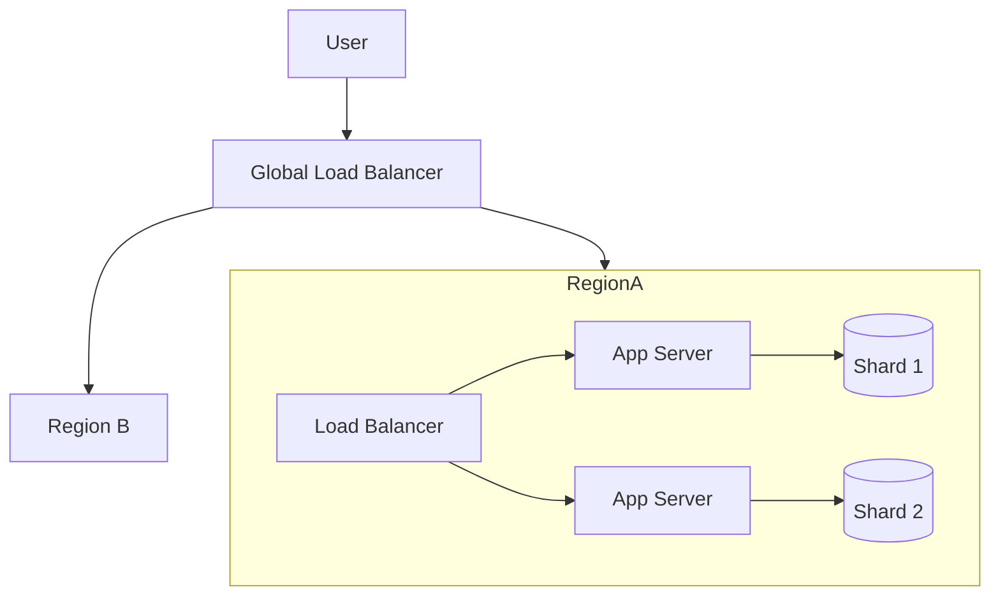

## 🧠 CONCEPT
**Scalability** is the capability of a system to handle a growing amount of work or its potential to be enlarged to accommodate that growth. A system is "scalable" if it can increase its performance or capacity in proportion to the resources added.

### Key Workloads
- **Request Workload**: Number of requests served per second (RPS/TPS).
- **Data Workload**: Volume of data stored (GB/TB/PB).

### Dimensions
- **Size Scalability**: Adding users/resources.
- **Geographical Scalability**: Serving multiple regions with acceptable latency.
- **Administrative Scalability**: Ease of management as the number of organizations/users grows.

---

## ❓ WHY THIS EXISTS
- **Growth Management**: Modern applications must survive "The Slashdot Effect" or viral growth without crashing.
- **Cost Efficiency**: Scaling out using commodity hardware is often cheaper than scaling up with specialized servers.
- **Performance Maintenance**: Ensuring that as users increase, response times (p99 latency) remain stable.

---

## 📉 HARDWARE MAPPING
- **Vertical Scaling (Up)**: Increasing CPU cores, RAM, or Disk speed on a single machine.
    - RAM Latency: ~100ns
    - Limit: Hardware ceiling (e.g., max RAM on a motherboard).
- **Horizontal Scaling (Out)**: Adding more commodity servers to a cluster.
    - Network Latency (Internal): ~0.5ms
    - Advantage: No theoretical ceiling; pay-as-you-go.

---

# ⚙️ INTERNAL MECHANICS

## 🔁 WRITE PATH (Scaling Out)
1. **Client** request hits **Global Load Balancer**.
2. Request routed to a specific **Shard/Partition** based on a Sharding Key (e.g., `user_id % N`).
3. Only a subset of the cluster handles the write, preventing a single-node bottleneck.
4. Data is replicated within the shard for availability.

## 🔍 READ PATH
1. **Load Balancer** distributes read requests across multiple **Read Replicas**.
2. **Caching Layer** (Redis/Memcached) absorbs frequent reads to reduce DB load.
3. **CDN** serves static content from edge locations close to the user.

## ⏳ TIME & STATE GAPS
- **Rebalancing Lag**: When adding a new node to a cluster, data must be moved (rebalanced). During this time, the system might experience higher latency or temporary unavailability.
- **Cache Staleness**: As a system scales, invalidating caches across a massive cluster introduces a time gap where users might see old data.

---

# 🏗️ ARCHITECTURE

---

# 🔗 CROSS-LAYER DEPENDENCIES
- **Upstream**: L1 Network (Bandwidth limits for inter-node communication).
- **Downstream**: L2 Storage (IOPS limits of the underlying disks).
- **Adjacent**: Load Balancing, Partitioning/Sharding.

---

# ⚖️ TRADE-OFFS
- **Scalability vs. Complexity**: Horizontal scaling requires complex logic for data partitioning, consensus, and service discovery.
- **Latency vs. Throughput**: Batching requests can increase throughput (scalability) but increases the latency of individual requests.

---

# 💥 FAILURE ANALYSIS

## 🔥 FAILURE TIMELINE (Hot Shard)
- **T0**: A famous celebrity posts a viral update (Shard 5 becomes "Hot").
- **T+10s**: CPU usage on Shard 5 hits 100%.
- **T+30s**: Request queue fills up; latency for all users in Shard 5 spikes.
- **T+1m**: Shard 5 starts dropping connections (Cascading failure).
- **Solution**: Auto-scaling group triggers or dynamic re-sharding (splitting the hot shard).

## 🧨 FAILURE TYPES
- **Resource Exhaustion**: Out of memory (OOM), Disk full.
- **Single Point of Failure (SPOF)**: A non-scalable load balancer or master database.
- **Contention**: Multiple nodes fighting for a single lock (Amdahl's Law limit).

---

# 🧠 CONSISTENCY & USER IMPACT
- **Scalability often forces Eventual Consistency**: Strong consistency (e.g., 2PC) scales poorly due to the "Slowest Node" problem.
- **Tail Latency (p99)**: In a massive system, a small percentage of slow requests (the "tail") can ruin the experience for many users.

---

# ⚔️ ADVANCED TOPICS
- **Sharding/Partitioning**: Dividing data into smaller, manageable chunks.
- **Consistent Hashing**: Minimizes data movement when nodes are added/removed from a cluster.
- **Microservices**: Scaling individual components of an app independently (e.g., scale the "Search" service more than the "Profile" service).
- **Backpressure**: Preventing a system from being overwhelmed by slowing down incoming requests.

---

# 🌍 REAL-WORLD EXAMPLES
- **Google Search**: Massive horizontal scaling across hundreds of thousands of nodes.
- **Twitter**: Moved from a monolithic "Feed" to a distributed fan-out architecture to handle celebrity tweets.
- **NoSQL Databases (Cassandra, MongoDB)**: Built specifically for horizontal scalability.

---

# ⚖️ COMPARISON
| Feature | Vertical Scaling | Horizontal Scaling |
|---|---|---|
| Limit | Hardware Ceiling | Virtually Unlimited |
| Cost | Exponential | Linear (Commodity) |
| Complexity | Low | High |
| SPOF | High | Low (Redundancy) |

---

# 🧠 DECISION HEURISTICS
- **Start with Vertical Scaling** if the load is predictable and fits on a single large server (Simplicity).
- **Move to Horizontal Scaling** when:
    - You hit the hardware limit of a single node.
    - High availability/fault tolerance is a requirement.
    - Growth is unpredictable and rapid.
