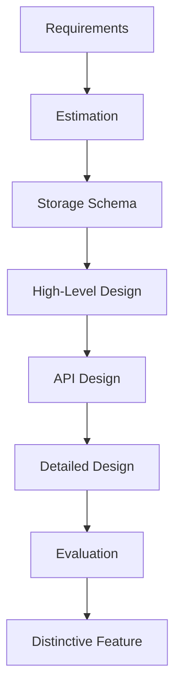

# 🧠 CONCEPT

RESHADED is a systematic, 8-step framework for decomposing and solving complex system design problems. It ensures that all critical aspects—from requirements gathering to evaluation and unique feature analysis—are addressed in a structured manner.

---

## ❓ WHY THIS EXISTS

- **Complexity Management:** System design problems are open-ended and "wicked." A framework prevents skipping critical steps (like non-functional requirements or estimation).
- **Communication:** Provides a common language and roadmap for engineers to present their solutions.
- **Completeness:** Ensures the final design is both functional and scalable.

---

# ⚙️ INTERNAL MECHANICS: THE 8 STEPS

| Letter | Step | Description |
| :--- | :--- | :--- |
| **R** | **Requirements** | Gather functional (features) and non-functional (availability, latency, etc.) requirements. Define scope. |
| **E** | **Estimation** | Calculate DAU, QPS, storage needs, and bandwidth. Determines the scale. |
| **S** | **Storage Schema** | (Optional) Define the data model, tables, and fields. |
| **H** | **High-level Design** | Block diagram of core components. Focus on basic functionality. |
| **A** | **API Design** | Define the contract between the user and the system (e.g., REST/gRPC endpoints). |
| **D** | **Detailed Design** | Address limitations of the HLD. Finalize components, workflows, and tech stack. |
| **E** | **Evaluation** | Validate the design against requirements. Discuss trade-offs (CAP, PACELC). |
| **D** | **Distinctive Feature** | Identify and solve the unique challenge of the specific problem (e.g., fraud for Uber). |

---

# 🏗️ ARCHITECTURE (Workflow)

---

# ⚖️ TRADE-OFFS

- **Rigidity vs. Flexibility:** While RESHADED provides a path, some problems might require jumping ahead (e.g., a "Distinctive Feature" might dictate the "Storage Schema").
- **Depth vs. Breadth:** In a timed interview, you must decide which sections of RESHADED deserve the most minutes based on the problem's constraints.

---

# 💥 FAILURE ANALYSIS

## 🔥 FAILURE TIMELINE (Missing the 'E' - Estimation)

1. **T0:** Engineer jumps straight from Requirements to High-Level Design.
2. **T1:** Proposes a single SQL database for a globally distributed social network.
3. **T2:** During evaluation, realize the write QPS is 1M+ and storage needs are PBs.
4. **T3:** Entire design must be scrapped and rewritten for sharded NoSQL.

👉 **Prevention:** Perform Estimation early to set the "Scale Tier" of the architecture.

---

# 🌍 REAL-WORLD EXAMPLES (The 'D' - Distinctive Feature)

- **Uber:** Payment processing and real-time fraud detection.
- **Google Docs:** Operational Transformation (OT) or CRDTs for concurrent editing.
- **YouTube:** Video encoding and global CDN distribution.
- **TinyURL:** Efficient encoding/hashing of long URLs.

---

# 🧠 DECISION HEURISTICS

1. **Clarify Early:** Use the **R** step to ask questions. Never start designing a "Search Engine" without knowing if it's for 1,000 documents or the entire web.
2. **Back of Envelope:** Use the **E** step to justify your tech choices (e.g., "We need 10TB of RAM for caching, so we need a distributed Redis cluster").
3. **Iterate:** High-level Design is a sketch; Detailed Design is the blueprint.
